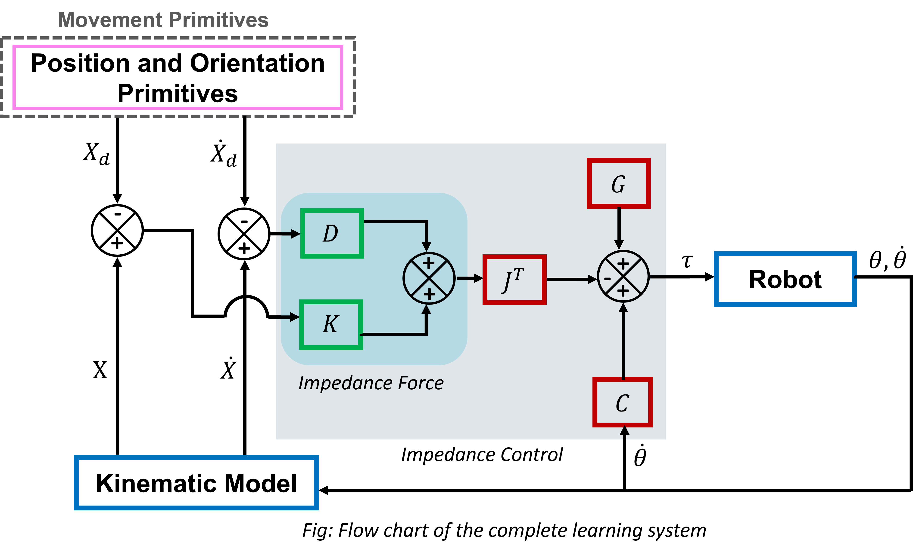
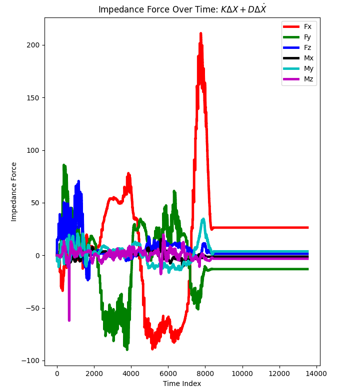

# DMP-Based Whiteboard Cleaning using Learning from Demonstration

This project demonstrates a **Learning from Demonstration (LfD)** framework for robotic whiteboard cleaning using **Dynamic Movement Primitives (DMPs)**. The robot learns a cleaning trajectory from human demonstrations and reproduces it autonomously.

---

## Human Demonstration

---

## Learned Trajectory Execution

---

## Overview

- Record a human demonstration of the whiteboard cleaning task.
- Learn the demonstrated trajectory using Dynamic Movement Primitives (DMPs).
- Generate a smooth and generalized trajectory for new executions.
- Track the generated trajectory using an impedance controller.
- Perform compliant whiteboard cleaning with the Doosan A0509 robot.

---

## Control Architecture

The learned Cartesian trajectory generated using Dynamic Movement Primitives is tracked using an impedance controller. The controller combines stiffness and damping feedback with gravity and Coriolis compensation to achieve compliant contact during the whiteboard cleaning task.

---

## Experimental Results

The figure below shows the Cartesian impedance force generated during task execution.

